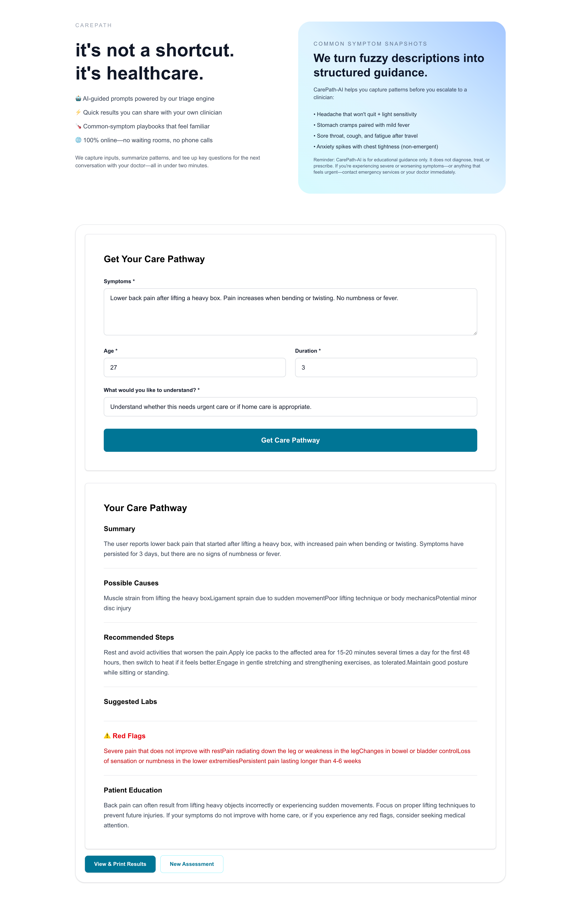

# CarePath-AI

CarePath-AI is a lightweight, AI-assisted symptom-to-care pathway prototype designed to explore how technology can make healthcare guidance clearer, safer, and more accessible. The project focuses on simplicity, structure, and helping users navigate moments of uncertainty without overwhelming them.

## 📌 Overview

CarePath-AI generates a structured, educational care pathway from a short symptom description. It is not a diagnostic tool. Instead, it provides:

- A clear summary
- General possible causes
- Safe recommended next steps
- Suggested labs (general and non-diagnostic)
- Red-flag warnings
- Patient education
- Print/PDF export for sharing with clinicians or saving for reference

The goal is to offer simple, easy-to-understand guidance for users who often feel unsure about what their symptoms might mean or what to do next.

## 🚀 Getting Started

### Prerequisites

- Node.js (v18 or higher)
- Python 3.8+
- PostgreSQL (optional, for database features)
- OpenAI API key

### Setup

1. **Clone the repository**

   ```bash
   git clone <repository-url>
   cd CarePath-AI
   ```

2. **Set up environment variables**

   ```bash
   cp .env.example .env
   # Edit .env and fill in your values:
   # - OPENAI_API_KEY (required)
   # - DATABASE_URL (required if using database)
   # - BACKEND_URL (optional, defaults to http://localhost:8000)
   ```

3. **Set up backend**

   ```bash
   cd backend
   python -m venv venv
   source venv/bin/activate  # On Windows: venv\Scripts\activate
   pip install -r requirements.txt
   ```

4. **Set up frontend**

   ```bash
   cd carepath-ai
   npm install
   ```

5. **Set up database (optional)**
   ```bash
   cd backend
   bash setup_database.sh
   ```

### Running the Application

**Option 1: Run both servers together (recommended)**

```bash
# From project root
npm run dev
# OR
./start_dev.sh
```

**Option 2: Run servers separately**

```bash
# Terminal 1 - Backend
cd backend
bash start_server.sh

# Terminal 2 - Frontend
cd carepath-ai
npm run dev
```

The application will be available at:

- Frontend: http://localhost:3000
- Backend API: http://localhost:8000

## 🎬 Demo



## 🩺 Problem This Solves

Many people struggle with:

- Understanding what their symptoms could indicate
- Knowing whether telehealth, urgent care, or ER care is appropriate
- Feeling anxious or overwhelmed by unclear health information
- Navigating care without regular access to primary care providers
- Communicating concerns clearly during medical visits

CarePath-AI aims to make this first step easier by providing structured clarity and actionable next steps.

## ⚙️ Tech Stack

### Frontend

- **Next.js (TypeScript)** – React framework with TypeScript
- **TailwindCSS** – Utility-first CSS framework
- **Browser Print API** – Native print functionality for PDF export

### Backend

- **FastAPI (Python)** – High-performance web framework
- **OpenAI API (gpt-4o-mini)** – Structured JSON output for care pathway generation
- **PostgreSQL** – Database for saving assessment history
- **SQLAlchemy** – ORM for database operations

## 🧠 How It Works

1. The user enters symptoms, age, duration, and their goal.
2. The FastAPI backend validates the input.
3. A safety-focused, structured prompt is sent to the OpenAI API.
4. The model returns a clean JSON object with predefined sections (summary, possible_causes, recommended_steps, suggested_labs, red_flags, education).
5. The result is automatically saved to PostgreSQL for history tracking.
6. The frontend displays the pathway clearly and allows printing/saving as PDF via browser print functionality.

This workflow keeps the experience simple, predictable, and user-friendly.

## 💾 Database Features

The application includes a PostgreSQL database that:

- Automatically saves all triage results with timestamps
- Provides REST API endpoints for retrieving, updating, and deleting results
- Supports querying by age and pagination
- Stores all care pathway data for future reference and potential personalization

The database is initialized automatically on server startup. Ensure `DATABASE_URL` is set in your `.env` file.

## 🔮 Future Enhancements

CarePath-AI is built as an MVP with room for deeper expansion, including:

- Visual urgency indicators (home care, telehealth, urgent care, ER)
- Clinician summary generator
- Multi-step reasoning pipeline (symptom extraction, red-flag screening, triage validation)
- Symptom timeline and trend insights
- User authentication and personal history dashboards

## 🧪 Testing

Coming soon:

- Unit tests for FastAPI routes
- Schema validation for input and output
- Mocked AI response tests
- Safety rule checks and red-flag validation
