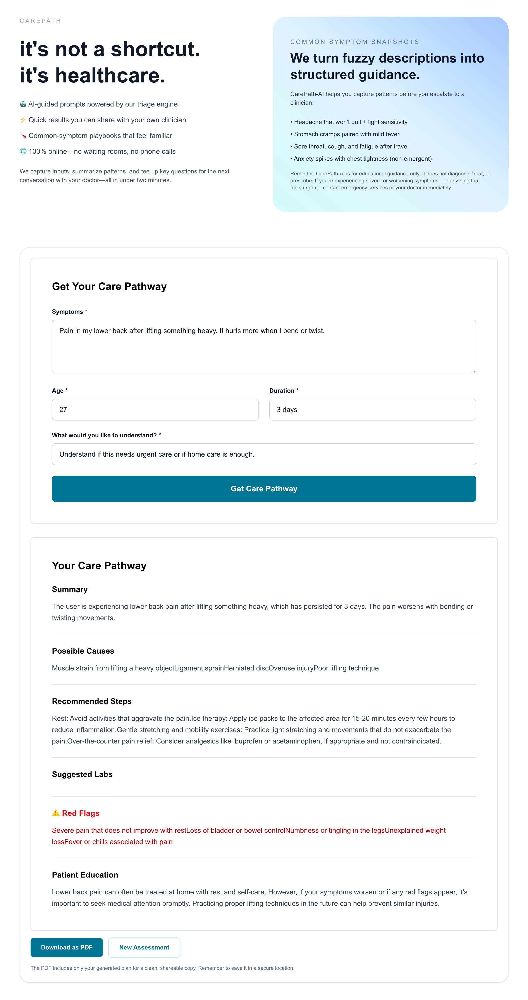

# CarePath-AI

A lightweight AI-powered symptom-to-care pathway assistant built in under 24 hours. Designed to explore how technology can make healthcare clearer and more accessible.

## 📌 Overview

CarePath-AI turns patient-reported symptoms into a safe, structured care pathway. It is not a diagnostic tool. Instead, it provides:

- A short summary
- General possible causes
- Safe recommended next steps
- Suggested labs (general, non-diagnostic)
- Red-flag warnings
- Patient education

The goal is to offer simple, understandable guidance for people who often feel overwhelmed or unsure about where to start with their symptoms.

## 🩺 Problem This Solves

Many people struggle with:

- Understanding what symptoms might mean
- Deciding whether telehealth or in-person care is appropriate
- Feeling lost in the healthcare process
- Navigating care without access to primary care providers

CarePath-AI aims to reduce confusion by giving users structured clarity and actionable steps, aligning with my belief in using technology to improve access and understanding in healthcare.

## ⚙️ Tech Stack

- **Next.js (TypeScript)** – frontend
- **FastAPI (Python)** – backend API
- **OpenAI API** – structured care pathway generation
- **TailwindCSS** – UI
- **PostgreSQL (optional)** – saving care history

## 🧠 How It Works

Users enter simple inputs (symptoms, age, goal, duration). The backend:

1. Validates the input
2. Sends a safety-focused structured prompt to the OpenAI API
3. Returns a clean JSON output with clear sections for the UI to display

This keeps the experience simple, predictable, and patient-friendly.

## 🧪 Testing

Coming soon. Basic unit tests for API validation and mocked AI responses will be added to support reliability and backend maturity.

## 🌟 Why This Project Matters

I've seen how overwhelming healthcare can be for people—especially those in families, communities, or regions where access is limited. Even small tools that offer clarity can make someone feel more confident and informed about their next step.

CarePath-AI represents my interest in building technology that reduces confusion, increases access, and empowers patients. It reflects why I'm drawn to healthcare engineering roles: the impact is real, personal, and meaningful.

# CarePath-AI

CarePath-AI is an early-stage prototype exploring how AI can turn user-reported symptoms into a clear, educational care pathway. It is **not** a diagnostic tool; instead, it aims to help people feel more prepared for their next clinical conversation.

## Overview

CarePath-AI currently provides:

- 📝 General symptom summary
- 🔍 Non-diagnostic possible causes
- ✅ Safe, practical next steps
- 🧪 Optional lab considerations
- ⚠️ Red-flag warnings and escalation cues
- 🎓 Patient-friendly education
- 📄 Downloadable PDF of the generated care pathway

The experience is designed to be simple, structured, and easy to understand.

## Demo

The current homepage pairs a refined hero section with the embedded triage workflow so visitors can see the intake and results flow in one glance.

## The Problem We’re Tackling

Many people struggle with:

- Determining whether symptoms are serious
- Choosing between telehealth, urgent-care, or emergency services
- Explaining symptoms succinctly to clinicians
- Managing care without a primary-care provider

CarePath-AI transforms “I don’t feel well” into a concise, structured summary that can guide decisions and discussions.

## Why It’s More Than “Just GPT”

Although it uses large language models, the value comes from product decisions and safety constraints:

- **Structured output:** predictable sections modeled after clinical triage notes.
- **Safety guardrails:** no diagnoses, prescriptions, or false certainty; every response highlights red flags.
- **Domain-aware prompts:** inputs account for duration, severity, mechanism of injury, and age.
- **Product thinking:** one-shot intake flow, educational experience, PDF export, and future-proofed architecture.

## Tech Stack

**Frontend**

- Next.js (TypeScript)
- Tailwind CSS

**Backend**

- FastAPI (Python)
- OpenAI API (structured JSON mode)
- PostgreSQL (future: save user history)
- PDF generation via `html2canvas` + `jsPDF`

## How It Works

1. User enters symptoms, age, duration, and goal.
2. FastAPI validates inputs and sends a structured, safety-focused prompt to OpenAI.
3. The LLM returns a strict JSON payload containing each care-path section.
4. The frontend renders a clean, patient-friendly layout, now with one-click PDF export.

This mirrors a light-weight intake → assessment → summary → export workflow.

## Current Features

- Clean, single-page intake form
- Structured care-path output
- Red-flag alerts and safety reminders
- “Get Care Pathway” CTA styled to match the hero theme
- Downloadable CarePath PDF for sharing with clinicians

### New: PDF Export

Users can now generate a polished PDF that includes:

- The AI-generated summary
- Suggested next steps
- Red-flag reminders
- Patient education content

This makes it easy to bring the output into telehealth visits or in-person appointments.

## Concept roadmap

The prototype is intentionally minimal but designed to support:

- **Multi-agent triage** (extraction → safety → reasoning → review)
- **Care routing visuals** (telehealth vs. urgent vs. ER)
- **Routing recommendations** and escalation timelines
- **Clinician-ready scripts** for concise handoffs
- **Symptom tracking** for longitudinal follow-up
- **Enhanced PDFs** with timelines or severity scores
- **Domain-specific modules** (injury, respiratory, GI, neurology, etc.)
- **Transparent reasoning** for better trust and auditing

## Testing (Planned)

To keep the prototype lightweight, automated tests haven’t shipped yet. Planned areas:

- FastAPI input validation
- Mocked LLM responses
- Guardrail / red-flag logic
- Prompt regressions

## Why This Matters

Healthcare is intimidating for many people—especially those without reliable access to care. Even small tools that clarify “what’s going on” can reduce anxiety and help patients make safer, more informed choices.

CarePath-AI reflects a commitment to building human-centered healthcare technology. It’s a foundation for exploring how AI can support people at the very first step of their care journey.

## Status & Next Up

- ✅ New hero layout and embedded triage flow on the homepage
- ✅ Downloadable PDF export for the generated care pathway
- 🔄 **In progress:** fetch and display saved CarePath results from PostgreSQL
